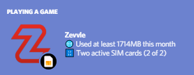
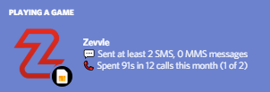
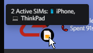

# Zevvle Discord Rich Presence
Not very well made, not very well tested - but it works(ish).

# Screenshots

# Known Issues
- Code is awful and I need to improve nearly everything
- The Zevvle API only returns the last 100 'records' for each SIM card, so data/calls/text information may not be accurate
- Hitting the Zevvle API multiple times every 15 seconds (every time the status updates) isn't very kind, perhaps we could cache the latest Zevvle stats every few minutes?

# Config
clientID - Discord Client ID

zSecret - Zevvle Zecret Token  
zReferralCode - Zevvle Ref Code (optional)

updateInt - How often to update the status (in seconds - min 15)  
dataUnits - Whether to show data in megabytes or gigabytes (MB or GB)

## Shameless Promo
If you join Zevvle with [my ref link](https://join.zevvle.com/OLMFN5) we both get an extra gig of data every month, that's pretty cool.